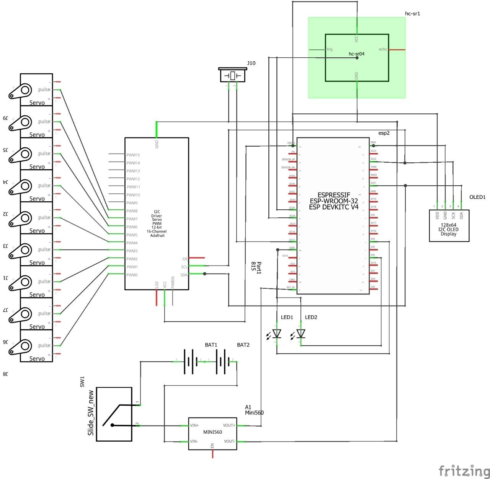
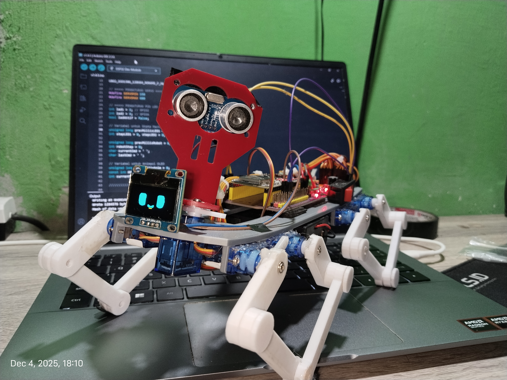
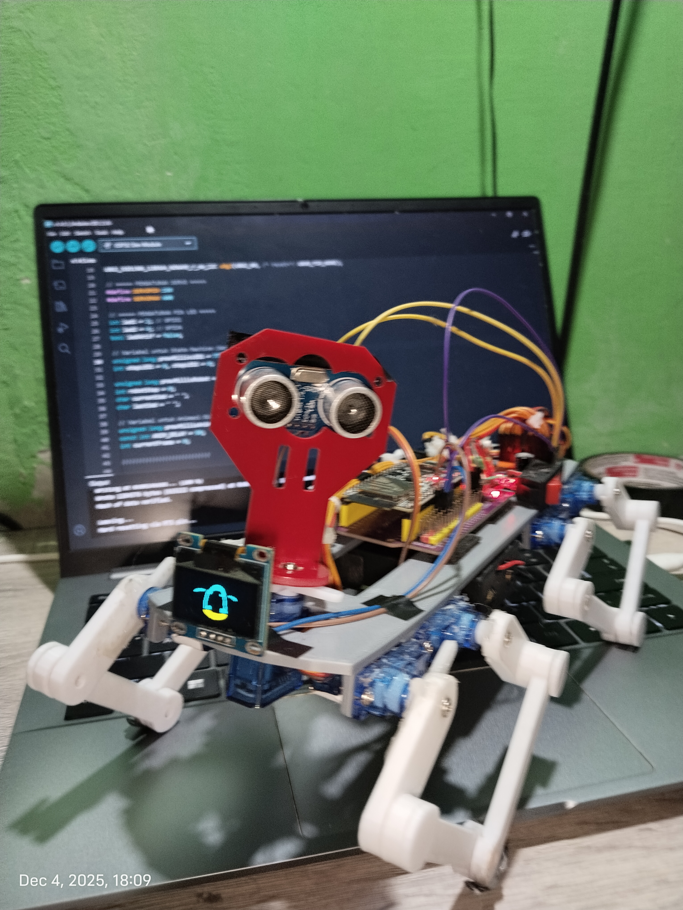
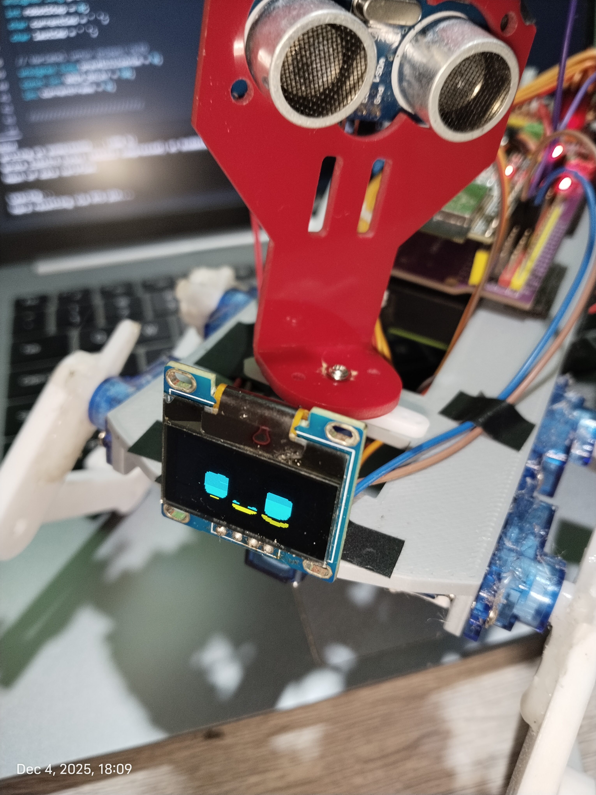
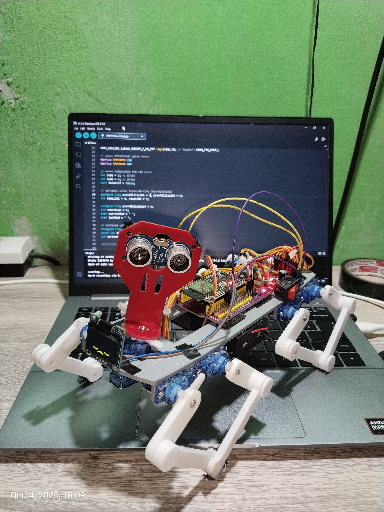

# Quadruped Robot Dog

## Overview

The Quadruped Robot Dog is an advanced, IoT-based robotics project. The current architecture (Version 2) represents a significant transition from a monolithic, cloud-dependent system to a highly modular, local-first framework. By utilizing the MQTT protocol, the project achieves seamless decoupling between the high-level decision logic executed via a Python backend and the low-level mechanical execution handled by an ESP32 microcontroller.

## Features

- **Decoupled Architecture:** Clean separation of concerns between hardware firmware and software control.
- **Local Network Operations:** Independent of external cloud services, utilizing a localized EMQX MQTT broker for minimal latency.
- **Dual-Interface Control:** Offers real-time manipulation via a dedicated keyboard listener or a responsive FastAPI-based web dashboard.
- **Autonomous Capabilities:** Integrates ultrasonic sensor feedback for obstacle avoidance in autopilot mode.
- **Dynamic Visual Feedback:** Features an I2C OLED display utilizing PROGMEM stored arrays for responsive eye animations.

## Repository Structure

```text
Quadruped-Robot-Dog/
├── Code/
│   ├── Code.ino                  # Main ESP32 Firmware state machine
│   ├── bitmaps.h                 # OLED animation hexadecimal data
│   └── secrets.h                 # Network and broker credentials
├── backend/
│   ├── config/
│   │   ├── commands.json         # Centralized command-to-payload JSON mapping
│   │   └── docker-compose.yml    # Configuration for the EMQX MQTT Broker
│   ├── backend.py                # Master launcher script for background services
│   ├── dashboard.py              # FastAPI Web Interface implementation
│   ├── movement.py               # Keyboard listener and control logic script
│   └── mqtt_client.py            # Centralized MQTT connection handler
├── docs/                         # Documentation and visual assets
├── testing/
│   └── testing.py                # Sequential hardware testing script
└── README.md
```

## Hardware and Schematics

The physical implementation relies on an ESP32 microcontroller interfacing with a PCA9685 PWM Servo Driver to manage articulation across multiple servos. Environmental interaction is facilitated by an HC-SR04 ultrasonic sensor and an SSD1306 OLED display.



*Figure 1: Complete wiring schematic demonstrating the connection between the ESP32, PCA9685 servo driver, OLED display, and the HC-SR04 ultrasonic sensor.*

### Physical Prototype Implementation

The structural assembly and hardware distribution of the quadruped robot are documented below:



*Figure 2: Primary assembly of the quadruped framework.*



*Figure 3: Side profile highlighting leg linkage mechanisms and calibration.*



*Figure 4: Frontal view showcasing the OLED display integration.*



*Figure 5: Detailed view of the internal hardware distribution.*

## Setup and Installation Guide

### 1. Embedded Firmware Configuration
1. Open the `Code/Code.ino` file using the Arduino IDE.
2. Ensure the installation of the following libraries: `PubSubClient`, `ArduinoJson`, `Adafruit PWM Servo Driver Library`, `Adafruit SSD1306`, and `Adafruit GFX Library`.
3. Modify `Code/secrets.h` to reflect your specific Wi-Fi SSID, Password, and local MQTT broker IP address.
4. Compile and flash the firmware to the ESP32 hardware.

### 2. Python Backend Initialization
1. Navigate to the project root directory via your terminal.
2. Deploy the local EMQX Broker using Docker:
   ```bash
   cd backend/config
   docker-compose up -d
   cd ..
   ```
3. Install the necessary Python dependencies:
   ```bash
   pip install paho-mqtt pynput fastapi uvicorn
   ```
4. Execute the master launcher. This script concurrently initializes the FastAPI web server and the keyboard input listener:
   ```bash
   python backend.py
   ```
5. To control the robot via the web interface, access `http://localhost:8081` using a standard web browser on any device connected to the local network.
